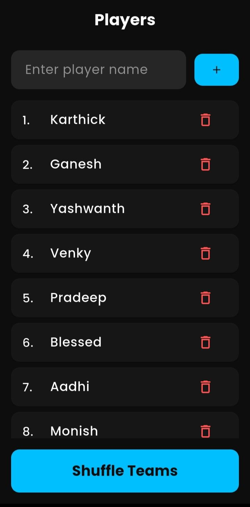
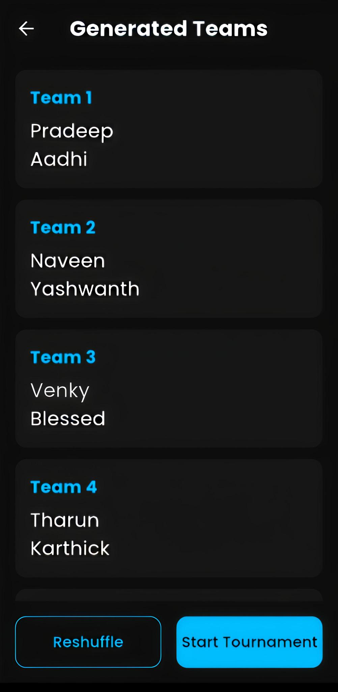
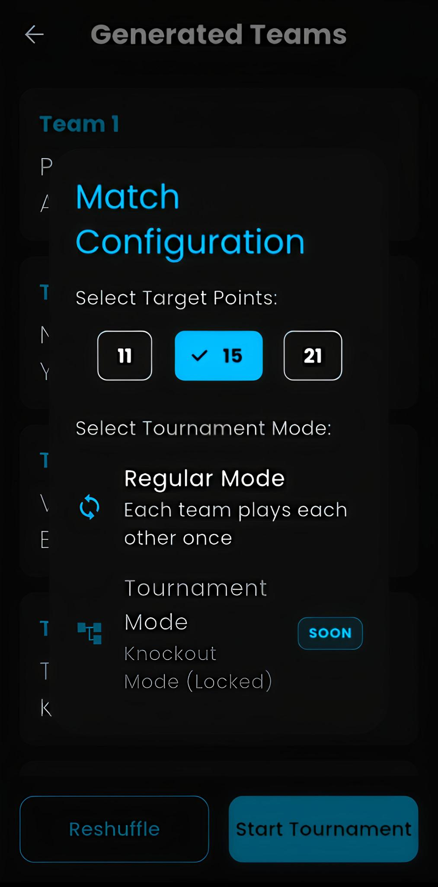
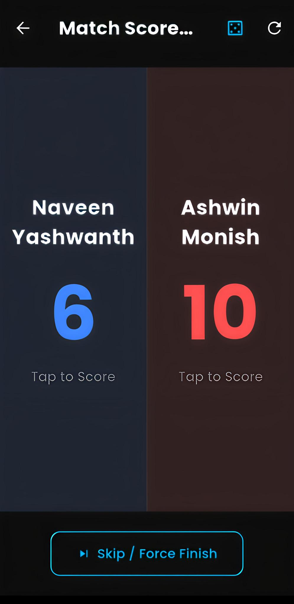
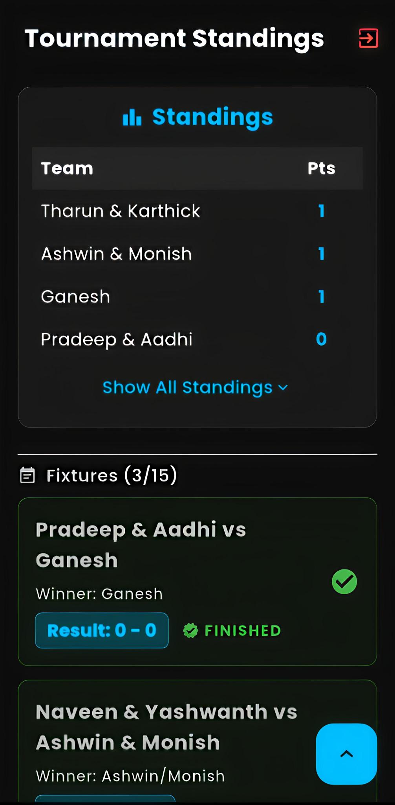

# Shuttle Shuffle 🏸

Shuttle Shuffle is a modern Flutter application designed to simplify team management and tournament orchestration for sports like Badminton. Whether you're playing casual matches or organizing a full-blown tournament, Shuttle Shuffle has you covered.

## 🚀 Features

- **Player Management**: Easily add, view, and manage your pool of players.
- **Smart Team Shuffling**: Randomly pair players into balanced teams with support for odd numbers of players.
- **Live Match Scoring**: Keep track of scores with a built-in scoreboard that handles win conditions (2-point lead, golden point cap).
- **Tournament Fixtures**: Generate Regular or Knockout fixtures automatically for your teams.
- **Local Persistence**: All your data is saved locally using Hive for a smooth offline experience.
- **Premium UI**: Sleek, modern interface with smooth transitions and responsive design.

## 🧠 Logic & Algorithms

### Team Shuffling
The shuffling logic ensures variety in pairings every time.
- If there's an odd number of players, the last player is placed in a single-person team.
- Uses the `dart:math` Random shuffle for unbiased pairings.

### Match Scoring
Standard Badminton-style scoring is implemented:
- **Winning Score**: Default set to 21 or 11 points.
- **Deuce Logic**: A team must win by 2 points if the score reaches the target (e.g., 20-20).
- **Golden Point**: A hard cap is set (target + 9, e.g., 30 points) where the first team to reach it wins regardless of the lead.

### Tournament Fixtures
- **Regular**: Implements the **Circle Method** to ensure every team plays every other team once in an organized schedule.
- **Knockout**: Simple knockout phase generation for the top 4 teams (Semi-finals followed by a Final). **(Coming Soon!)**

## 📸 Screenshots

| 1. Player Input | 2. Team List | 3. Mode & Points |
| :---: | :---: | :---: |
|  |  |  |

| 4. Match Scoreboard | 5. Points Table |
| :---: | :---: |
|  |  |

## 📦 App Size & Performance

- **Android**: ~18-25 MB (Full APK)
- **iOS**: ~35-45 MB
- **Windows**: ~40-50 MB
- **Storage**: Extremely lightweight (~2-5 MB for database and local preferences).

The app is optimized for speed and low memory usage, ensuring a smooth experience even on older devices.

## 🛠️ Installation & Requirements

### Prerequisites
- [Flutter SDK](https://docs.flutter.dev/get-started/install) (v3.10.0 or higher)
- [Dart SDK](https://dart.dev/get-dart)
- Android Studio / VS Code with Flutter extension

### Steps
1. **Clone the repository**:
   ```bash
   git clone https://github.com/Karthicks24/Shuttle_Shuffle.git
   cd Shuttle_Shuffle
   ```
2. **Install dependencies**:
   ```bash
   flutter pub get
   ```
3. **Generate Hive models**:
   ```bash
   flutter pub run build_runner build
   ```
4. **Run the app**:
   ```bash
   flutter run
   ```

## 🧪 Testing
Run the comprehensive test suite to ensure everything is working correctly:
```bash
flutter test
```

## 📦 Dependencies
- `flutter_bloc`: State Management
- `hive`: Local Storage
- `get_it`: Dependency Injection
- `dartz`: Functional Programming (Either/Option)
- `uuid`: Unique ID generation
- `mocktail`: Mocking for tests
